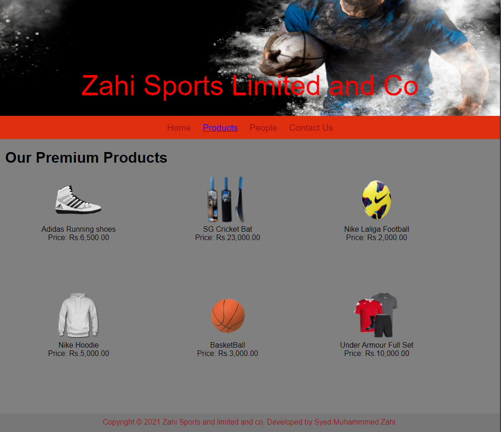
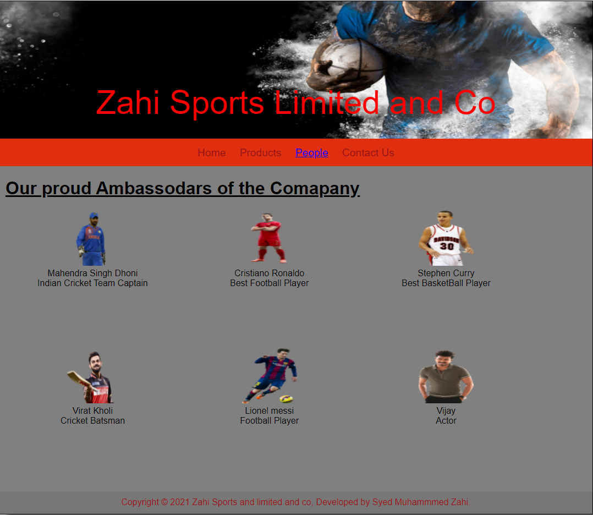
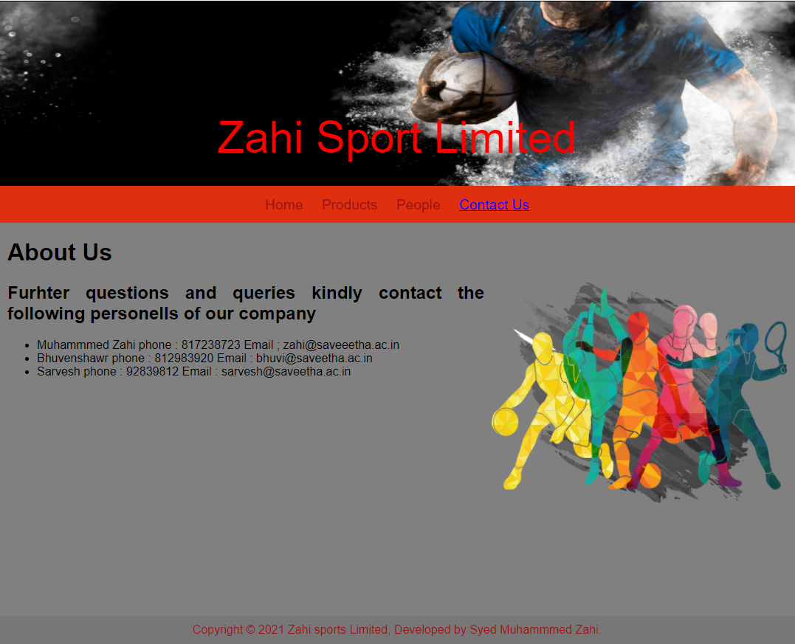

# Web Design for a Software Product Company

## AIM:

To design a static website for a software product company company.

## DESIGN STEPS:

### Step 1:

Requirement collection.

### Step 2:

Creating the layout using HTML and CSS.

### Step 3:

Updating the sample content.

### Step 4:

Choose the appropriate style and color scheme.

### Step 5:

Validate the layout in various browsers.

### Step 6:

Validate the HTML code.

### Step 6:

Publish the website in the given URL.

## PROGRAM :
~~~
home code:
<!DOCTYPE html>
<html lang="en">
  <head>
    <title>Zahi Sports Limited and Co </title>
    <link rel="stylesheet" href="./css/layout.css" />
    <link rel="icon" href="https://www.vhv.rs/dpng/d/555-5558210_z-letter-png-logo-transparent-png.png" type="image/x-icon" />
  </head>

  <body>
    

      
Zahi Sport Limited

      

        
<a href="/static/home.html">Home</a>

        
<a href="/static/products.html">Products</a>

        
<a>People</a>

        
<a>Contact Us</a>

      

      

        

          <h1>About Us</h1>
          
          

            Sport pertains to any form of competitive physical activity or game that aims to use, maintain or improve physical ability and skills while providing enjoyment to participants and, in some cases, entertainment to spectators. Sports can, through casual or organized participation, improve one's physical health. Hundreds of sports exist, from those between single contestants, through to those with hundreds of simultaneous participants, either in teams or competing as individuals
             
            Our company aims in delivering the best equipments for your physical needs and amenities .With top of the quality materials we aim in giving you the best and the most quality of the finest sports gear 

            <ul>
              <li>The top brands at the cheapest of prices </li>
              <li>top quality and the best brands available for everyone at the best price</li>
              <li>For the first purchase ou get amazing offers for the top brands</li>
            </ul>
          

        

      

      

        Copyright &#169; 2021 Zahi sports Limited, Developed by Syed Muhammmed Zahi.
      

    

  </body>
</html>
 PRODUCT code:
 <!DOCTYPE html>
<html lang="en">
  <head>
    <title>Zahi Sports</title>
    <link rel="stylesheet" href="./css/layout.css" />
    <link rel="icon" href="https://www.vhv.rs/dpng/d/555-5558210_z-letter-png-logo-transparent-png.png" type="image/x-icon" />
  </head>

  <body>
    

      
Zahi Sports Limited and Co

      

        
<a href="/static/home.html">Home</a>

        

          <a href="/static/products.html">Products</a>
        

        
<a>People</a>

        
<a>Contact Us</a>

      

      

        
    
          <h1>Our Premium Products</h1>
          

              
 
                  

                  
                  

                  
Adidas Running shoes

                  
Price: Rs.6,500.00 

              

              
 
                  

                  
                  

                  
SG Cricket Bat

                  
Price: Rs.23,000.00 

              

              
 
                

                
                

                
Nike Laliga Football

                
Price: Rs.2,000.00 

            

            
 
              

              
              

              
Nike Hoodie 

              
Price: Rs.5,000.00 

          

          
 
            

            
            

            
BasketBall

            
Price: Rs.3,000.00 

        

        
 
          

          
          

          
Under Armour Full Set

          
Price: Rs.10,000.00 

      

          

          
        
      

      

        Copyright &#169; 2021 Zahi Sports and limited and co, Developed by Syed  Muhammmed Zahi.
      

    

  </body>
</html>
People code:
<!DOCTYPE html>
<html lang="en">
<head>
    <title>Zahi Sports</title>
    <link rel="stylesheet" href="./css/layout.css" />
    <link rel="icon" href="https://www.vhv.rs/dpng/d/555-5558210_z-letter-png-logo-transparent-png.png" type="image/x-icon" />
</head>
 <body>

    
Zahi Sports Limited and Co

    

        
<a href="/static/home.html">Home</a>

        

          <a href="/static/products.html">Products</a>
        

        
<a href="/static/People.html">People</a>

        
<a>Contact Us</a>

      

      

        
    
         <u> <h1>Our proud Ambassodars of the Comapany</h1></u>
          

              
 
                  

                  
                  

                  
Mahendra Singh Dhoni

                  
Indian Cricket Team Captain

              

              
 
                  

                  
                  

                  
Cristiano Ronaldo 

                  
 Best Football Player

              

              
 
                

                
                

                
Stephen Curry 

                
Best BasketBall Player 

            

            
 
              

              
              

              
 Virat Kholi 

              
Cricket Batsman 

          

          
 
            

            
            

            
Lionel messi

            
Football Player

        

        
 
          

          
          

          
Vijay

          
Actor

      

          

          
        
      

      

        Copyright &#169; 2021 Zahi Sports and limited and co, Developed by Syed  Muhammmed Zahi.
      

    

  </body>
</html>

Contact Code:
<!DOCTYPE html>
<html lang="en">
  <head>
    <title>Zahi Sports Limited and Co </title>
    <link rel="stylesheet" href="./css/layout.css" />
    <link rel="icon" href="https://www.vhv.rs/dpng/d/555-5558210_z-letter-png-logo-transparent-png.png" type="image/x-icon" />
  </head>

  <body>
    

      
Zahi Sport Limited

      

        
<a href="/static/home.html">Home</a>

        
<a href="/static/products.html">Products</a>

        
<a href="/static/People.html">People</a>

        
<a href="/static/Contact us.html">Contact Us</a>

      

      

        

          <h1>About Us</h1>
          
          

            <h2> Furhter questions and queries kindly contact the following personells of our company</h2>

            <ul>
              <li>Muhammmed Zahi phone : 817238723 Email ; zahi@saveeetha.ac.in</li>
              <li>Bhuvenshawr phone : 812983920 Email :  bhuvi@saveetha.ac.in </li>
              <li>Sarvesh phone : 92839812 Email : sarvesh@saveetha.ac.in</li>
            </ul>
          

        

      

      

        Copyright &#169; 2021 Zahi sports Limited, Developed by Syed Muhammmed Zahi.
      

    

  </body>
</html>

CSS Code:
 {
  box-sizing: border-box;
  font-family: Arial, Helvetica, sans-serif;
}
body {
  background-color: whitesmoke;
  color: black;
}
.container {
  width: 1080px;
  margin-left: auto;
  margin-right: auto;
  border-width: 1px 1px 1px 1px;
  border-style: solid;
  box-shadow: 15px 15px 8px gray;
}

.banner {
  display: block;
  width: 100%;
  height: 250px;
  text-align: center;
  font-size: 60px;
  background-image: url("https://t3.ftcdn.net/jpg/03/24/64/44/360_F_324644401_lYsDy30Cjk7e3WRPEnt7qck5h9GktqPU.jpg");
  background-size: 100% 100%;
  margin: 0px 0px 0px 0px;
  padding-top: 150px;
  color:red;
}

.menu {
  display: block;
  width: 100%;
  height: 50px;
  font-size: larger;
  background-color:#df2f0f;
  text-align: center;
  padding-top: 15px;
  margin: 0px 0px 0px 0px;
  border-width: 1px;
}

.menuitem {
  display: inline-block;
  margin-left: 10px;
  margin-right: 10px;
}
.menuitemselected {
  display: inline-block;
  margin-left: 10px;
  margin-right: 10px;
  color: #16d1ae;
}

.menuitem a {
  text-decoration: none;
  color: #9c1018;
}

.content {
  display: block;
  width: 100%;
  background-color:grey;
  min-height: 500px;
  margin: 0px 0px 0px 0px;
  border-width: 1px;
  border-color: grey;
  border-style: solid;
}
.homecontent {
  min-height: 500px;
  margin: 10px 10px 10px 10px;
}
.homecontent h1 {
  text-align: left;
}
.homecontent img {
  float: right;
  width: 400px;
  height: 300px;
  margin-left: 10px;
}

.contenttext {
  text-align: justify;
}

.productcontent {
  min-height: 500px;
  margin: 10px 10px 10px 10px;
}

.productcontent h1 {
  text-align: left;
}

.productitems {
  display: block;
}

.productitem {
  display: inline-block;
  width: 30%;
  height: 250px;
  text-align: center;
}

.productitem img {
  width: 100px;
  height: 100px;
  display: block;
}
.productitem .itemimage {
  display: block;
  margin-left: auto;
  margin-right: auto;
  width: 100px;
  margin-bottom: 5px;
}

.productitem .itemname {
  display: block;
}
.productitem .itemprice {
  display: block;
}

.footer {
  display: block;
  width: 100%;
  height: 40px;
  background-color: #777777;
  text-align: center;
  padding-top: 10px;
  margin: 0px 0px 0px 0px;
  color: #9c1018;
}
~~~

## OUTPUT:

### Home Page:

### Product Page:

### People Page:

### Contact Page:

### 

## Result:

Thus a website is designed for the software product company and the HTML,CSS code are validated.
